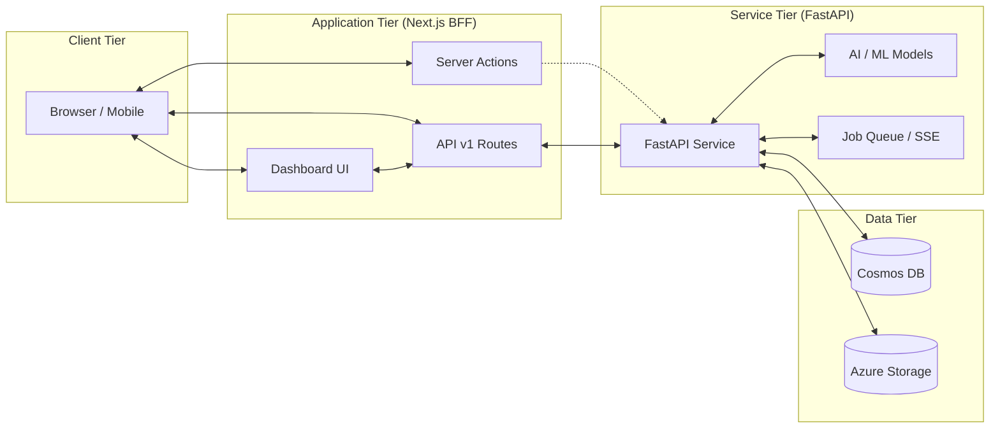

# Architecture

## System Architecture

The AI-ME Template Dashboard follows a modern, decoupled architecture designed for security and scalability. It separates the user interface and frontend logic from the high-performance AI backend.

## Key Architectural Patterns

### 1. Backend-for-Frontend (BFF)

The Next.js App Router serves as the BFF. All requests from the client-side UI to the backend go through the Next.js middle tier. This ensures that:

- API keys, database credentials, and backend URLs are never exposed to the client.
- Authentication and session management are handled on the server.
- Data can be transformed or aggregated before reaching the UI.

### 2. Unified Contract (`api/v1`)

Both the Next.js BFF and the FastAPI service adhere to a versioned API contract. This ensures consistent data envelopes, error models, and pagination rules across the entire stack.

### 3. ActionResult Mutation Pattern

For write operations (mutations), the template uses a standardized `ActionResult<T>` pattern in Next.js Server Actions. This provides a typed, predictable way to handle success and failure states, including validation errors.

### 4. Async Workload Management

The architecture is designed to handle long-running AI tasks. The FastAPI service manages job execution and provides state updates, which the Next.js BFF can stream to the client via SSE (Server-Sent Events) or provide via a polling fallback mechanism.

### 5. Multi-Tenant / RBAC Design

The navigation and server actions are designed with role-based access control (RBAC) in mind. Menus and actions can be filtered by user roles and scopes retrieved during the authentication phase.
